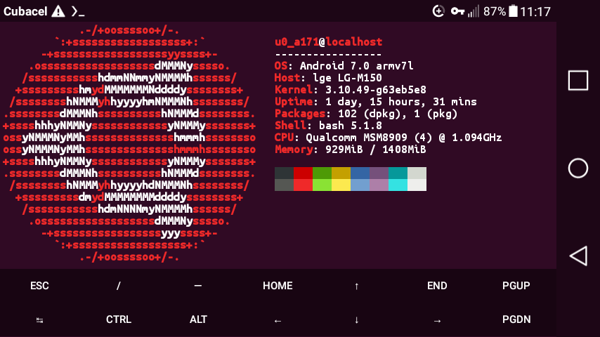

# termux-ubuntu-theme
Ubuntu Terminal color scheme for Termux.

## Installation instructions.
Open a new session in Termux and issue the following commands.
1. `git clone https://github.com/nikofabelo/termux-ubuntu-theme`
2. `cd termux-ubuntu-theme`
3. `cd .termux`
4. `cp * $HOME/.termux`

After doing so, exit the app, then open it again, changes will be applied.

## Screenshots.

## DISCLAIMER
Ubuntu Mono Bold font (font.ttf file) is released under the [UFL](https://assets.ubuntu.com/v1/81e5605d-ubuntu-font-licence-1.0.txt) license. 
Regarding Ubuntu Terminal color scheme it may have it's own copyright notice, same I couldn't find.
